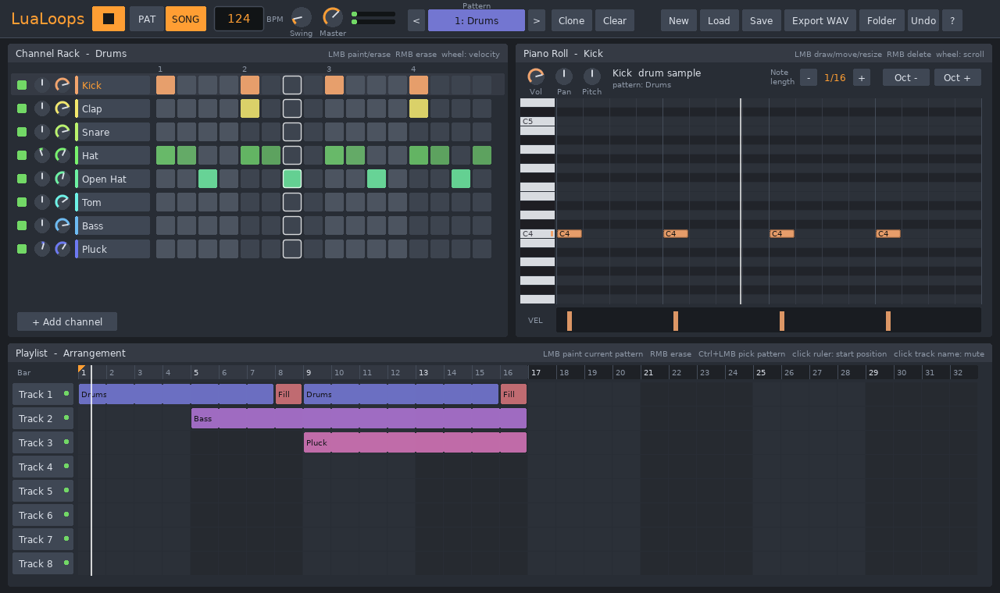

<p align="center"></p>

# FL-STUD-LUA

В репозитории три части:

0. **[FL LUA](web/README.md)** — веб-DAW в браузере: AudioWorklet-движок с сэмпл-точным планированием, Channel Rack + Step Sequencer, Piano Roll, Playlist, микшер на 125 инсертов, 10 инструментов и 21 эффект (включая модульный **Patcher**), аудиоредактор, запись звука, экспорт WAV/FLAC/OGG/MP3/MIDI. Запуск: `cd web && node tools/serve.mjs`.

1. **[Подробный разбор FL Studio](docs/FL_Studio_razbor.md)**: история, ядро программы, редакции, эксклюзивы All Plugins Edition, что нового в FL Studio 2026, экономика выбора редакции, сильные и слабые стороны.
2. **LuaLoops** — собственный бесплатный open-source битмейкер на Lua ([LÖVE](https://love2d.org)) с паттерновым воркфлоу в духе FL Studio (Channel Rack → Piano Roll → Playlist). Собирается в Windows `.exe`.

> **Про «бесплатную версию FL Studio».** Взломанную или «разлоченную» сборку FL Studio здесь делать не буду: это нарушение лицензии Image-Line. Легальные бесплатные варианты:
> - **официальный триал FL Studio** (<https://www.image-line.com/fl-studio/download>): все функции без ограничения по времени, но сохранённый проект нельзя открыть повторно до покупки;
> - **LuaLoops** из этого репозитория;
> - **LMMS** (<https://lmms.io>) — зрелая open-source DAW с похожей паттерновой логикой.
>
> LuaLoops не содержит кода, звуков или графики Image-Line и не связан с компанией. Все звуки синтезируются кодом.



---

## LuaLoops: скачать и запустить (Windows)

**Вариант 1 — готовая сборка.** На вкладке **Actions** репозитория откройте последний успешный запуск `build` и скачайте артефакт **`LuaLoops-win64`**. Распакуйте архив и запустите `LuaLoops.exe`. DLL-файлы должны лежать рядом с exe.

SmartScreen может предупредить, что exe не подписан: «Подробнее» → «Выполнить в любом случае».

**Вариант 2 — собрать самому** (Linux, macOS или Git Bash на Windows):

```bash
tools/build.sh
# результат: dist/LuaLoops-win64/LuaLoops.exe и dist/LuaLoops-win64.zip
```

Скрипт упаковывает `src/` в `LuaLoops.love`, скачивает официальный рантайм LÖVE 11.5 для Windows (проверяет SHA-256) и «склеивает» `love.exe + LuaLoops.love` → `LuaLoops.exe` (стандартный способ дистрибуции LÖVE-игр).

**Вариант 3 — без сборки.** Установите LÖVE 11.5 и выполните `love src`.

## Что умеет

| Раздел | Возможности |
|---|---|
| **Channel Rack** | 16-шаговый секвенсор; рисование и стирание протягиванием мыши; velocity колесом; громкость и панорама на канал; mute/solo; добавление, дублирование, перемещение, удаление, смена инструмента |
| **Piano Roll** | Ноты выбранного канала: рисование, перемещение, изменение длины, удаление; лейн velocity; настройки канала (Vol/Pan/Pitch/Tone); превью нот |
| **Playlist** | 8 дорожек × 32 такта; паттерны «рисуются» по тактам; mute дорожек; стартовая позиция с линейки; режимы PAT/SONG |
| **Звук** | 14 встроенных инструментов, все синтезированы кодом: Kick, Snare, Clap, Hat, Open Hat (choke-группа с Hat), Tom, Rim, Shaker, Bass, 808, Pluck, Lead, Keys (FM), Pad. Свинг, мастер-громкость с мягким лимитером, индикаторы уровня |
| **Проект** | 9 паттернов (Clone/Clear/переименование); сохранение и загрузка `.llp`; drag-and-drop файла в окно; автосохранение; Undo/Redo (Ctrl+Z/Ctrl+Y) |
| **Экспорт** | WAV 16 bit / 44.1 kHz: песня целиком (SONG) или паттерн (PAT) |

Секвенсор работает с точностью до сэмпла, а воспроизведение и экспорт используют один и тот же движок. Поэтому WAV звучит ровно так же, как проект в программе.

## Управление

| Клавиши / мышь | Действие |
|---|---|
| `Space` | Play / Stop |
| `L` | Переключить PAT / SONG |
| `1`…`9`, `←` `→` | Выбор паттерна |
| `↑` `↓` (`Shift` — ×10) | Темп |
| `Z S X D C V G B H N J M ,` | Играть ноты выбранного канала с клавиатуры |
| `Ctrl+S` / `Ctrl+Shift+S` | Сохранить / сохранить как новый |
| `Ctrl+O`, `Ctrl+N`, `Ctrl+E` | Открыть, новый проект, экспорт WAV |
| `Ctrl+Z`, `Ctrl+Y` | Отмена / повтор |
| `F1` | Справка |
| Ручки | Тянуть вверх/вниз (`Shift` — точно), колесо; ПКМ — сброс |
| Playlist | ЛКМ — нарисовать текущий паттерн, ПКМ — стереть, `Ctrl`+ЛКМ — взять паттерн из клипа |

Файлы (проекты, экспорты, автосохранение) лежат в `%APPDATA%\LuaLoops`. Кнопка **Folder** открывает эту папку.

## Разработка

```
src/
  main.lua, conf.lua     точка входа LÖVE, транспорт, файлы, горячие клавиши
  lib/engine.lua         секвенсор + микшер голосов (реальное время и офлайн-рендер)
  lib/sounds.lua         синтез ударных и описания синтезаторов
  lib/project.lua        модель данных и валидация загружаемых файлов
  lib/serialize.lua      формат .llp (Lua-таблица, исполняется в пустом окружении)
  lib/wav.lua            запись WAV
  lib/ui.lua             мини-GUI (immediate mode)
  lib/selftest.lua       headless-тесты
  views/                 Channel Rack, Piano Roll, Playlist, верхняя панель
tests/ui_smoke/          UI-тест: скриптованные клики и нажатия по реальному приложению
tools/build.sh           сборка .love и Windows .exe
```

Тесты:

```bash
love src --selftest                                  # движок, формат файлов, экспорт
xvfb-run -a love tests/ui_smoke                      # UI-сценарий (нужен дисплей)
love src --export demo.wav                           # отрендерить демо-песню в WAV
```

CI (`.github/workflows/build.yml`) на каждый push прогоняет тесты, собирает Windows-пакет и публикует его как артефакт.

## Лицензия

MIT (см. [LICENSE](LICENSE)). Рантайм LÖVE распространяется под лицензией zlib; его лицензия лежит в сборке рядом с exe.
